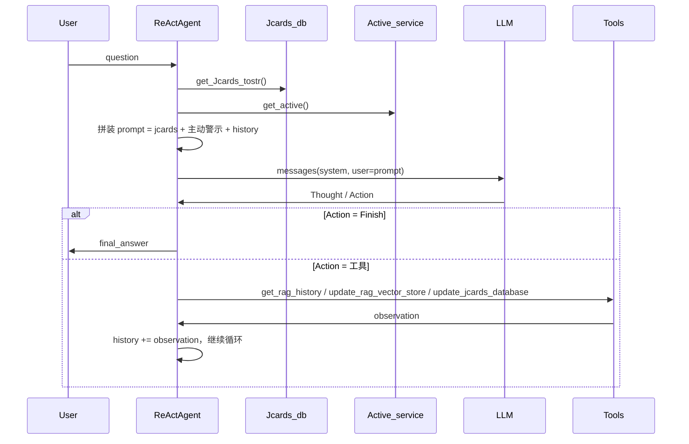

# ReActAgent 集成 RAG/Jcards 与主动警示

## 目标

- ReActAgent 只使用 [ToolExecutor.py](group1/ToolExecutor.py) 中定义的**三个工具**：`get_rag_history`、`update_rag_vector_store`、`update_jcards_database`（不再使用 `search`/`get_current_time`，且当前 ToolExecutor 中后两者已被注释，需统一）。
- **每轮用户输入后**：将**全部 jcards** 和**全部主动警示内容**拼入发给模型的提示中（固定上下文，非工具调用）。
- **由模型自主决定**：何时调用 RAG 查询（`get_rag_history`）、何时修改 RAG（`update_rag_vector_store`）、何时修改 jcards（`update_jcards_database`）。

## 数据流概览

- **固定注入**：每步循环开始时，从 `Jcards_db` 取全量 jcards、从 `Active_service.get_active()` 取主动警示，与当前 `history` 一起组成发给模型的 `user` 内容。
- **工具调用**：仅在模型输出 `Action: ToolName[...]` 时执行对应工具，将返回结果格式化为 Observation 写入 history。

## 实现要点

### 1. ReActAgent 依赖与构造

- **新增依赖**：`ReActAgent` 需要持有 `Jcards_db`、`Embed_db`、以及可选的 `Active_service`（用于主动警示）。若暂无 `Active_service` 实现，可传 `None`，此时主动警示段落为空。
- **构造方式**：在 [ReAct.py](group1/ReAct.py) 中扩展 `ReActAgent.__init__(self, llm_client, tool_executor, jcards_db, embed_db, active_service=None, max_steps=5)`，并在内部根据这三个工具注册**带闭包的包装函数**（见下），保证 `get_rag_history` 能访问 `jcards_db`/`embed_db`，且工具入参与 ReAct 的单一字符串 `tool_input` 约定一致。

### 2. 三个工具的注册与包装

[ToolExecutor.py](group1/ToolExecutor.py) 中三个函数签名与 ReAct 的「单字符串 tool_input」不一致，需要在 ReAct 侧做一层包装后再注册到 `ToolExecutor`：

| 原始函数                                                                     | 包装后暴露给模型的工具名（建议）                | 包装逻辑                                                                                                                                                                                                                                                      |
| ------------------------------------------------------------------------ | ------------------------------- | --------------------------------------------------------------------------------------------------------------------------------------------------------------------------------------------------------------------------------------------------------- |
| `get_rag_history(query, jcards_db, embed_db)`                            | `RAGQuery` 或 `GetRAGHistory`    | 包装为 `(tool_input: str) -> str`：`tool_input` 即 `query`；内部调用 `get_rag_history(tool_input, self.jcards_db, self.embed_db)`，返回 `List[str]` 时用 `"\n".join(...)` 转成字符串作为 Observation。                                                                           |
| `update_rag_vector_store(action, concluded_content, chunk_ids=..., ...)` | `UpdateRAG` 或 `RAGUpdate`       | 包装为 `(tool_input: str) -> str`：约定 `tool_input` 为 **JSON 字符串**，包含 `action`、`concluded_content` 及可选字段（如 `chunk_ids`、`conversation_id`、`turn_id`、`speaker`、`timestamp`、`correct_behavior`）；解析后调用 `update_rag_vector_store(...)`，将返回值元组格式化为字符串作为 Observation。 |
| `update_jcards_database(action, card_content, number)`                   | `UpdateJcards` 或 `JcardsUpdate` | 包装为 `(tool_input: str) -> str`：约定 `tool_input` 为 **JSON 字符串**，包含 `action`（Add/Correct/Delete）、`card_content`（Add/Correct 必填）、`number`（Correct/Delete 必填）；解析后调用 `update_jcards_database(...)`，无返回值时固定返回如 "Jcards 已更新。" 作为 Observation。                     |

- 包装函数建议在 [ReAct.py](group1/ReAct.py) 内实现（例如 `_wrap_get_rag_history`、`_wrap_update_rag`、`_wrap_update_jcards`），这样可直接使用 `self.jcards_db`、`self.embed_db`。若希望 ToolExecutor 保持“无状态”，也可在 ReAct 的 `__init__` 里用闭包绑定 `jcards_db`/`embed_db` 再传给 `tool_executor.registerTool(...)`。
- 在 `__init__` 中创建 `ToolExecutor`（或使用外部传入的），并**只注册**上述三个工具，不再注册 Search/Time（与“只使用三个工具”一致；若需保留 Search/Time，需在 ToolExecutor 中恢复其实现并单独讨论）。

### 3. 每轮提示中注入 jcards 与主动警示

在 [ReAct.py](group1/ReAct.py) 的 `run(question)` 主循环内，**在组装发给 LLM 的 `prompt` 时**：

- 每步先取：
  - `jcards_list = self.jcards_db.get_Jcards_tostr()`（若未实现可先返回 `[]`）；
  - 若 `self.active_service` 非空：`active, active_content = self.active_service.get_active()`；否则 `active_content = []` 或 `None`。
- 将「当前 jcards」和「主动警示内容」拼成一段固定上下文，例如：
  - `当前 Jcards 列表：\n{'\n'.join(jcards_list) 或 '（暂无）'}\n\n主动警示：\n{'\n'.join(active_content) if active_content else '（无）'}\n\n---\n对话历史：`
- 再拼接 `self.history`（含 "用户请求: ..." 与后续 Thought/Action/Observation）。
- 用上述整体作为当轮的 `user` content（或拆成 system 中一段 + user 中 history，只要保证 jcards 与主动警示每轮都完整出现即可）。

这样满足「jcards 和主动警示在每次用户输入提示词后都会全部跟随提示词一起发给模型」。

### 4. 系统提示与工具描述

- 在 [ReAct.py](group1/ReAct.py) 的 `AGENT_SYSTEM_PROMPT` 中：
  - 说明模型会**在每轮**看到「当前 Jcards 列表」和「主动警示」；需要检索历史对话片段时，应使用 RAG 查询工具；需要增删改聊天记录或 jcards 时，使用对应修改工具。
  - 列出三个工具的名称、用途及**输入格式**（尤其是两个 update 工具使用 JSON），例如：
    - `GetRAGHistory`：输入为查询字符串，返回与查询相关的历史对话片段。
    - `UpdateRAG`：输入为 JSON，包含 `action`（Add/Correct）、`concluded_content` 及 Correct 时的 `chunk_ids` 等字段。
    - `UpdateJcards`：输入为 JSON，包含 `action`（Add/Correct/Delete）、`card_content`、`number`（Correct/Delete 时）。
- 保持原有 Thought/Action/Finish 的格式要求不变。

### 5. 工具调用的参数解析与 Observation

- 当 `_parse_action` 得到 `(tool_name, tool_input)` 后，若 `tool_name` 为上述三个之一，直接调用已注册的包装函数（单参数 `tool_input`）；包装内部负责 JSON 解析与调用真实函数。
- 将工具返回的字符串（或格式化后的元组/列表）以 `Observation: ...` 形式追加到 `self.history`，与现有 ReAct 流程一致。

### 6. 与 ToolExecutor / group1 的衔接

- [ToolExecutor.py](group1/ToolExecutor.py) 中 `get_rag_history`、`update_rag_vector_store`、`update_jcards_database` 已定义，但后两者目前为 `pass`。本方案只负责在 ReAct 侧注册与调用；具体实现仍保留在 ToolExecutor/group1 中后续补齐。
- ReAct 需能 import `Jcards_db`、`Embed_db`、`Active_service` 等，可从 [group1.py](group1/group1.py) 导入；`get_rag_history` 等三个函数从 ToolExecutor 导入。
- [ReAct.py](group1/ReAct.py) 当前 `from ToolExecutor import ToolExecutor, search, get_current_time` 应改为从 ToolExecutor 只导入 `ToolExecutor` 与三个工具函数（`get_rag_history`、`update_rag_vector_store`、`update_jcards_database`），不再导入 `search`、`get_current_time`，避免因后者被注释而报错。

### 7. 可选：主入口示例

- `if __name__ == '__main__'` 中构造 `Jcards_db()`、`Embed_db()`、`Active_service()`（或 None），创建 `ToolExecutor` 并仅注册上述三个包装后的工具，再创建 `ReActAgent(..., jcards_db=..., embed_db=..., active_service=...)`，调用 `agent.run(question)` 做一次完整对话示例。

## 文件修改清单

| 文件                                        | 修改内容                                                                                                                                                                                                                                                                    |
| ----------------------------------------- | ----------------------------------------------------------------------------------------------------------------------------------------------------------------------------------------------------------------------------------------------------------------------- |
| [ReAct.py](group1/ReAct.py)               | 1) 修改 import，只从 ToolExecutor 导入 ToolExecutor 与三个工具函数；2) 扩展 `ReActAgent.__init__`，增加 `jcards_db`、`embed_db`、`active_service`，并注册三个包装工具；3) 在 `run()` 每轮拼装 prompt 时注入 jcards 与主动警示；4) 更新 `AGENT_SYSTEM_PROMPT`，描述三个工具及 JSON 格式；5) 主入口改为使用三个工具及 group1 的 DB/Active_service。 |
| [ToolExecutor.py](group1/ToolExecutor.py) | 无需为本次需求修改逻辑；若希望 ReAct 主入口可运行，需确保 `get_rag_history` 在无真实 embed 时能返回（例如空列表或占位），避免运行时错误。                                                                                                                                                                                   |

## 风险与注意点

- **RAG_query 内部**： [group1.py](group1/group1.py) 中 `RAG_query.retrieve` 调用 `_get_query_embeddings(query)` 但方法签名为 `_get_query_embeddings(self, query, RAG_write)`，缺少 `RAG_write` 参数，属于既有问题；若实际跑 RAG 需在 group1 内修复。
- **主动警示**：若 `Active_service.get_active()` 尚未实现，可先传 `active_service=None`，提示中主动警示部分显示为「（无）」即可。
- **JSON 格式**：模型可能输出非法 JSON，包装函数内需做 try/except，失败时返回明确错误信息作为 Observation，便于模型重试。

